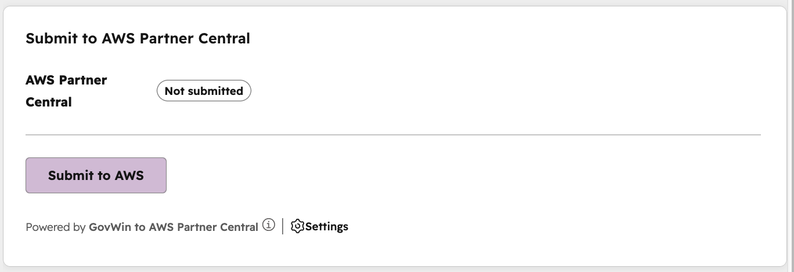
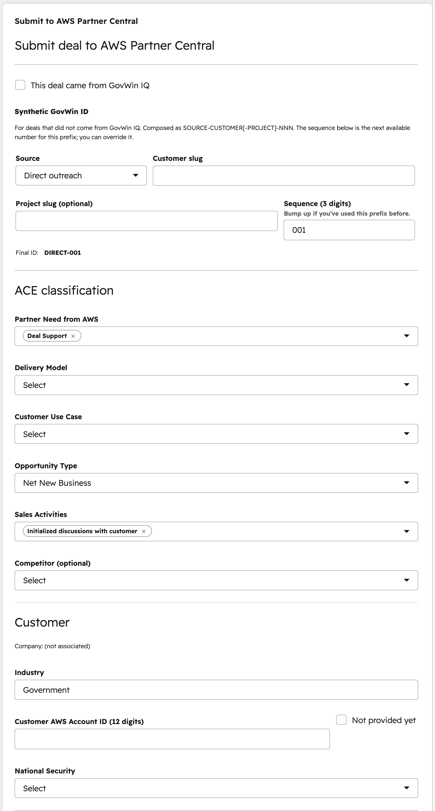
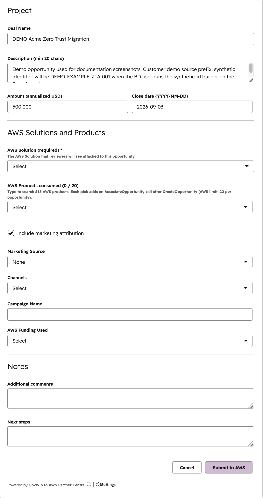
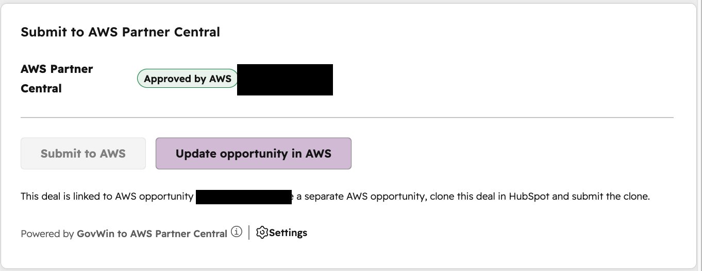
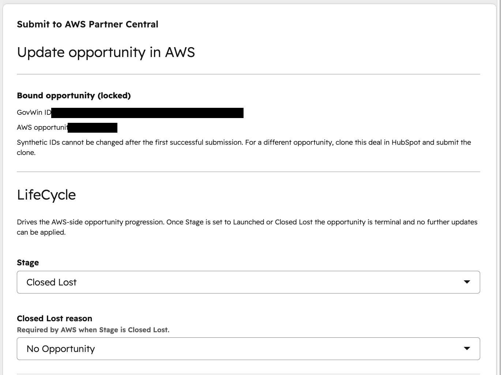
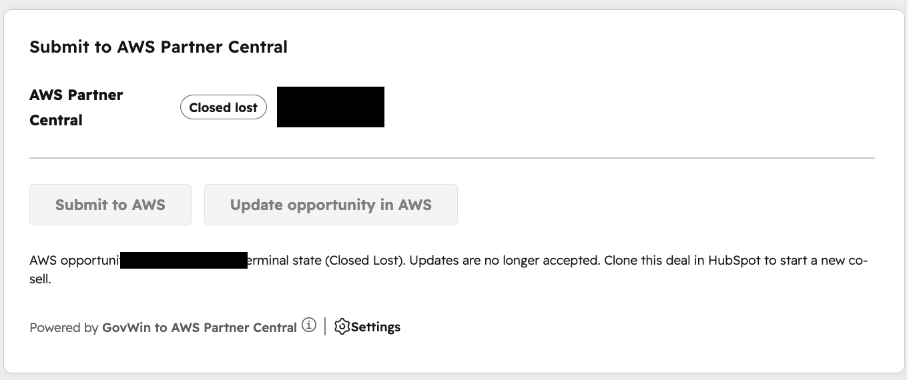

# Business Development User Guide

This guide is for the Business Development (BD) team member who works deals in
HubSpot and submits them to Amazon Web Services (AWS) Partner Central for
co-sell. You do everything from a single card on the HubSpot deal record. You do
not need Terraform, the AWS console, or any command line.

If you are looking for the technical or deployment documentation, see the
[README](../README.md) and the [Deployment Guide](deployment-guide.md). This
page is only the day-to-day operator workflow.

---

## 1. What this does

Opportunities you mark for download in Deltek GovWin IQ flow automatically into
HubSpot as deals on the GovWin Pipeline. You review each deal, and when it is
ready you submit it to AWS Partner Central directly from a card on the deal. AWS
reviews the submission; as the AWS review status changes, that status flows back
onto the deal on its own. You never have to log in to AWS Partner Central to
check on a deal: the card shows you where it stands.

In short: GovWin brings the opportunity in, you submit it from the card, and AWS
status comes back to the card automatically.

---

## 2. Before you start

- **Where deals appear.** Synced opportunities land on the **GovWin Pipeline**
  in HubSpot. Each one is a deal record. Open a deal to see its details and the
  submission card.
- **What "marked for sync" means.** Only opportunities you mark for download in
  GovWin IQ are pulled into HubSpot. This is deliberate: it keeps HubSpot focused
  on the opportunities you actually intend to pursue, instead of every record in
  GovWin. If a deal you expected is not in HubSpot, check that it is marked in
  GovWin and wait for the next sync (the pipeline checks GovWin hourly).
- **The card.** On every deal you will see a card titled **Submit to AWS Partner
  Central**. That card is your entire workflow: it shows current status, opens
  the Submit form, and opens the Update form.
- **Who to contact for access.** If you do not see the GovWin Pipeline or the
  card, or a deal is missing, contact your HubSpot administrator or the
  integration owner for your organization.

*The card as it appears on a deal that has not yet been submitted.*

---

## 3. Submitting a deal to AWS

When a deal is ready for co-sell, submit it from the card.

1. Open the deal on the GovWin Pipeline.
2. On the **Submit to AWS Partner Central** card, click **Submit to AWS**. The
   Submit form opens.
3. Fill in the form. Three fields are required:
   - **Partner Need from AWS** (pick at least one): what you want AWS to help
     with on this deal, such as deal support.
   - **Delivery Model** (pick at least one): how the solution is delivered.
   - **Customer Use Case**: the primary use case for the customer.
   - There are more fields you will usually want to set, covered below, but
     those three are the ones the form will not let you skip.

   
   *Top of the Submit form: the deal source and the required classification
   fields.*

4. Review the common optional fields:
   - **Source of the deal.** If the deal came from GovWin IQ, leave the "This
     deal came from GovWin IQ" box checked and confirm the GovWin Opportunity
     ID. If it did not come from GovWin, uncheck the box and build a synthetic
     ID with the helper; the helper walks you through it. This identifier is
     permanent in AWS, so for a non-GovWin deal pick an identifier you have not
     used before.
   - **Customer AWS Account ID.** Twelve digits, used for launch attribution. If
     the customer has not shared it yet, check **Not provided yet** to skip it
     for now and add it later from the Update form.
   - **Industry** and, when Industry is Government, **National Security**.
   - **Deal Name, Description, Amount, Close date.** Description must be at least
     20 characters when you enter one.
   - **AWS Solution.** Pick the solution from the dropdown. The list comes from
     your AWS Partner Central solutions. In the AWS (production) catalog a
     solution is required; in Sandbox it is optional.
   - **AWS Products, Marketing attribution, Notes.** Optional.
5. Click **Submit to AWS**.

*Bottom of the Submit form: customer and project details, AWS solution, and the
Submit to AWS button.*

**What happens next.** When you submit, the deal stage advances on its own to
the submission stage, and the card begins showing AWS status. **Do not drag the
deal stage yourself**; submitting from the card moves it for you. Within a few
minutes the card status changes from Queued to Submitted to AWS.

---

## 4. Tracking AWS review status

After you submit, the card shows a read-only status badge that follows the deal
through AWS review. You do not refresh anything; the status updates itself as
AWS acts on the submission. The statuses you will see:

| Card status | What it means |
|---|---|
| **Queued** | Your submission was accepted and is being sent to AWS. |
| **Submitted to AWS** | AWS has received the opportunity. |
| **Under AWS review** | AWS is reviewing the opportunity. |
| **Approved by AWS** | AWS approved the co-sell opportunity. |
| **Action required** | AWS needs something from you; the card shows the next steps AWS sent. |
| **Closed lost** | The opportunity ended without a win. |
| **Launched** | The opportunity launched (a win). |

A typical AWS review takes one to three business days. When the status is
**Action required**, the card shows the next steps AWS provided so you know what
to address.

*The status badge tracks the AWS-side review without any action from you.*

---

## 5. Updating a live deal

After a deal is submitted, the card's button changes to **Update opportunity in
AWS**. Use the Update form to change details on a deal that is already in AWS:
amount, close date, deal name, description, the classification fields, and the
customer AWS account ID if you skipped it at submission.

Two things to know:

- The GovWin or synthetic identifier and the AWS opportunity are locked at the
  top of the Update form. You can see them, but you cannot change them. They are
  permanent in AWS for the life of the opportunity. If you truly need a
  different opportunity, clone the deal in HubSpot and submit the clone.
- **Edits are blocked by AWS while a deal is in active review.** While AWS has
  the deal in Submitted or Under review, AWS does not accept changes, including
  closing it. If your edit does not seem to take during that window, that is
  why; wait until the review finishes (Approved or Action required) and then
  make the change.

---

## 6. Closing or launching a deal

You close or launch a deal from the Update form, not by dragging stages.

1. Open the deal and click **Update opportunity in AWS** on the card.
2. In the **LifeCycle** section, open the **Stage** dropdown.
3. To close the deal as lost, pick **Closed Lost**. A **Closed Lost reason**
   dropdown appears; you must pick a reason (AWS requires it).
4. To record a win, pick **Launched**. The deal moves to Closed Won.
5. Click **Update opportunity**.

Once a deal is **Launched** or **Closed Lost**, it is terminal: AWS no longer
accepts further changes, and the card disables the Update button. The deal
settles on the terminal stage automatically, and a Closed Lost reason is
mirrored back onto the deal, so what you see in HubSpot matches AWS.

*Closing a deal: pick Closed Lost (with a reason) or Launched from the Stage
dropdown.*

*What a terminal Closed Lost deal looks like: the card status badge reads
Closed lost, the Update button is disabled, and the AWS opportunity ID is
locked at the top.*

---

## 7. What NOT to do

- **Do not drag pipeline stages by hand.** Submitting from the card advances the
  stage for you, and AWS status flows back to set the stage. Dragging a stage
  yourself can put the deal out of step with AWS.
- **Do not hand-edit the AWS co-sell properties** (the fields whose names start
  with `govwin_ace_`). The card and the integration own those. Editing them
  directly can trigger an alert and confuse the deal's state.
- **Do not resubmit a deal that is already in review.** It already has an
  opportunity in AWS; the card will tell you so. Use the Update form instead.
- **Do not reuse a synthetic identifier** you have used on another deal. AWS
  keeps these unique forever.

---

## 8. Troubleshooting and who to call

- **A deal I marked in GovWin is not in HubSpot.** Confirm it is marked for
  download in GovWin IQ and give it up to an hour for the next sync.
- **The card says this deal already has an AWS opportunity.** It was already
  submitted. Refresh the card to see its current status, and use the Update form
  for any changes.
- **My edit did not take.** If the deal is in Submitted or Under review, AWS is
  blocking edits during its review. Wait for the review to finish, then retry.
- **The status badge says Status unknown.** Refresh the card. If it persists,
  contact the integration owner.
- **Anything else.** Contact your HubSpot administrator or the integration owner
  for your organization.
